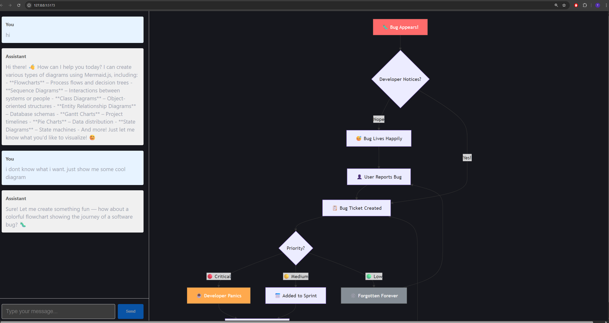

# Structure Flow

A split-screen web application that turns natural language into diagrams through a conversational chat interface, powered by Claude AI.



## Features

- **Conversational diagramming** — describe what you want in plain English and the AI generates a Mermaid.js diagram instantly
- **Context-aware** — follow-up messages refine or extend the current diagram, with the full conversation history passed to the model each turn
- **Split-screen layout** — chat on the left, live diagram on the right
- **Swappable AI providers** — toggle between providers via a single environment variable; ships with OpenAI and Anthropic stubs for development, and a real Claude integration for production

## Stack

| Layer | Technology |
|-------|-----------|
| Frontend | React + TypeScript + Vite |
| Diagramming | Mermaid.js |
| Backend | FastAPI (Python) |
| AI | Anthropic, OpenAI (provider-agnostic) |
| Package management | uv |

## Getting started

### Prerequisites

- Python ≥ 3.11
- Node.js ≥ 18
- [uv](https://docs.astral.sh/uv/getting-started/installation/)

### Configure environment

```bash
cp backend/.env.example backend/.env
```

The default config (`MODEL_PROVIDER=stub_openai`) uses stub responses — no API keys required.

To use the real Claude integration, set in `backend/.env`:

```
MODEL_PROVIDER=anthropic
ANTHROPIC_API_KEY=your-key-here
```

### Install dependencies

```bash
make install
```

### Run

```bash
make dev
```

This starts both servers concurrently:

| Server | URL |
|--------|-----|
| Frontend | http://localhost:5173 |
| Backend | http://localhost:8000 |

## Testing

### Backend unit tests

```bash
make -C backend test
```

### E2E tests

```bash
make -C frontend e2e
```
